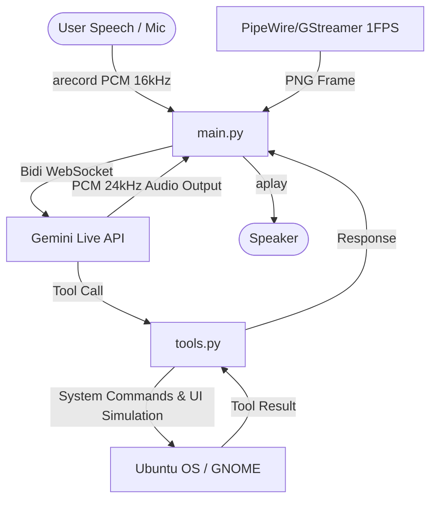

# Ubuntu Jarvis (V1.0) - Voice Assistant & OS Automation Agent

Ubuntu Jarvis, real-time, low-latency voice and vision-capable OS assistant powered by the **Gemini Live API** (`gemini-3.1-flash-live-preview`). It provides a hands-free voice interface to control Ubuntu desktops, automate UI interaction, execute commands, track system status, configure settings, and proactively offer screen insights using native Linux system tools.

## Key Features

- **Multimodal Live Interaction**: Full bidirectional audio streaming. Talk to the assistant naturally using the deep, masculine "Orus" hacker voice.
- **Micro-Gated Acoustic Echo Cancellation & Barge-In**: Real-time RMS monitoring suppresses self-echo when the bot is speaking. If you speak louder than the configured `BARGE_IN_THRESHOLD`, the bot instantly stops audio playback and listens to you.
- **Context Window Compression**: Configured with a sliding window, enabling continuous and unlimited audio-video sharing sessions without hitting standard 2-minute limits.
- **Silent Screen-Sharing (Wayland Support)**: Screencast capture connects directly to D-Bus `org.gnome.Mutter.ScreenCast` creating a quiet PipeWire node. Frame extraction (PNG) runs in the background using GStreamer at 1.0 FPS, preventing screen flashes, notification portals, or shutter sounds.
- **Reasoning & Planning Capability**: Integrates Gemini's internal `thinking_config` (`thinking_budget: 2048` tokens) to support step-by-step reasoning and dynamic multi-step plan updates for complex execution chains (like SSH server analysis and remote password updates).
- **Proactive Screen Advisor**: Monitors idle time. If no active voice input or command has run for a configurable interval (`PROACTIVE_VISION_INTERVAL="45"` seconds), it checks your active window, code, or browser sekmeleri to proactively provide intelligent tips, debug advice, or comments in hacker style.
- **Ubuntu Management Tools**:
  - `execute_command`: Secure shell commands with automatic localized `sudo` detection and stdin isolation.
  - `adjust_volume`: Change volume percentage via `amixer`.
  - `get_system_status`: Inspect CPU, RAM, and Disk space.
  - `show_desktop_notification`: Push notifications via `notify-send`.
  - `open_application` / `open_url`: Launch default apps (with fallback logic) and browser pages.
  - `simulate_keyboard` / `simulate_key_combination`: Key presses and shortcuts (e.g. browser navigation) using `ydotool` (Wayland compatible).
  - `click_mouse` / `move_mouse` / `drag_mouse`: Automated clicking, mouse holding/releasing, and drag-and-drop.
  - `configure_auto_updates` / `get_auto_updates_status`: Easily schedule or query Ubuntu's automatic upgrades (`unattended-upgrades`).
- **Persistent Memory**: Retains facts about the user across sessions using `memory.json`.

---

## Architecture



---

## Installation & Setup

### 1. System Dependencies
Ensure you have the required audio, git, and Wayland automation packages installed:
```bash
sudo apt update
sudo apt install -y git arecord aplay amixer notify-send xdg-utils gstreamer1.0-plugins-good gstreamer1.0-tools pipewire
```

For Wayland-based keyboard and mouse automation, install `ydotool`:
```bash
sudo apt install -y ydotool
# Ensure the ydotoold daemon is configured to run automatically
```

### 2. Project Clone & Virtual Environment
```bash
git clone <your-repo-url> ubuntu-jarvis
cd ubuntu-jarvis

# Create a virtual environment
python3 -m venv .venv
source .venv/bin/activate

# Install requirements
pip install google-genai
```

### 3. Configuration (`.env`)
Create a `.env` file in the root directory:
```env
GEMINI_API_KEY="your-google-api-key"
SUDO_PASSWORD="your-ubuntu-sudo-password"
MODEL_NAME="gemini-3.1-flash-live-preview"
BARGE_IN_THRESHOLD="0.15"
DEBUG_RMS="false"
SCREEN_SHARE="true"
SCREEN_SHARE_FPS="1.0"
VOICE_NAME="Orus"
PROACTIVE_VISION_INTERVAL="45"
```

---

## Running the Assistant

Ensure your virtual environment is active and launch the main loop:
```bash
python3 main.py
```
*(If the virtual environment is not active, the script automatically attempts to relaunch itself using the `.venv` interpreter).*

Press `Ctrl+C` to stop the session safely. Subprocesses will automatically clean up.
